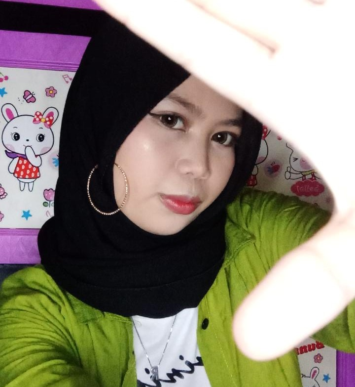

# Praktikum 4 - Pemograman Web
```
Riska Puspa Anggraeni Putri
TI.19.A2
311910440
```
## Langkah 1
### Membuat dokumen HTML dengan nama file lab4_box.html. Setelah itu buat struktur dasar HTML
```
<!DOCTYPE html>
<html lang="en">
<head>
 <meta charset="UTF-8">
 <meta name="viewport" content="width=device-width, initial-scale=1.0">
 <title>Box Element</title>
</head>
<body>
 <header>
 <h1>Box Element</h1>
 </header>
</body>
</html>
```

## Langkah 2
### Membuat Box Element
```
<section>
 <div class="div1">Div 1</div>
 <div class="div2">Div 2</div>
 <div class="div3">Div 3</div> 
</section>
```

## Langkah 3
### CSS Float Property
```
<style>
 div {
 float:left;
 padding: 10px; 
 }
 .div1 {
 background: red;
 }
 .div2 {
 background: yellow;
 }
 .div3 {
 background: green;
 }
</style>
```

## Langkah 4
### Mengatur Clearfix Element
#### Tambahkan element div lainnya seteleah div3
```
<section>
 <div class="div1">Div 1</div>
 <div class="div2">Div 2</div>
 <div class="div3">Div 3</div> 
 <div class="div4">Div 4</div> 
</section>
```

#### Kemudian atur property clear pada CSS
```
.div4 {
background-color: blue;
clear: left;
float: none;
}
```

### Membuat Layout Sederhana 
#### buat folder baru dengan nama lab4_layout , kemudian Membuat dokumen HTML dengan nama file home.html, dan file css dengan nama style.css. Setelah itu buat struktur dasar HTML ke file home.html
```
<!DOCTYPE html>
<html lang="en">
<head>
    <meta charset="UTF-8">
    <meta name="viewport" content="width=device-width, initial-scale=1.0">
    <title>Layout Sederhana</title>
    <link rel="stylesheet" href="style.css">
</head>
<body>
    <div id="container">
       
    </div>
</body>
</html>
```


#### Kemudian tulis kode
```
 <header>
            <h1>Layout Sederhana</h1>
           </header>
           <nav>
            <a href="home.html" class="active">Home</a>
            <a href="artikel.html">Artikel</a>
            <a href="about.html">About</a>
            <a href="kontak.html">Kontak</a>
           </nav>
           <section id="hero"></section>
           <section id="wrapper">
            <section id="main"></section>
            <aside id="sidebar"></aside>
           </section>
           <footer>
            <p>&copy; 2021 - Universitas Pelita Bangsa</p>
           </footer>
```

#### Kemudian tambahkan kode CSS untuk membuat layoutnya
```
/* import google font */
@import
url('https://fonts.googleapis.com/css2?family=Open+Sans:ital,wght@0,300;0,400;0,600;0,700;0,800;1,300;1,400;1,600;1,700;1,800&display=swap');
@import
url('https://fonts.googleapis.com/css2?family=Open+Sans+Condensed:ital,wght@0,300;0,700;1,300&display=swap');
/* Reset CSS */
* {
 margin: 0;
 padding: 0;
}
body {
 line-height:1;
 font-size:100%;
 font-family:'Open Sans', sans-serif;
 color:#5a5a5a;
}
#container {
 width: 980px;
 margin: 0 auto;
 box-shadow: 0 0 1em #cccccc;
}
/* header */
header {
 padding: 20px;
}
header h1 {
 margin: 20px 10px;
 color: #b5b5b5;
}
```

#### Membuat Navigasi
``` 
/* navigasi */
nav {
 display: block;
 background-color: #1f5faa;
}
nav a {
 padding: 15px 30px;
 display: inline-block;
 color: #ffffff;
 font-size: 14px;
 text-decoration: none;
 font-weight: bold;
}
nav a.active,
nav a:hover {
 background-color: #2b83ea;
}
```

#### Membuat Hero Panel
##### Tambahkan kode HTML
```
<section id="hero">
 <h1>Hello World!</h1>
 <p>Lorem ipsum dolor sit amet, consectetur adipiscing elit. Vestibulum lorem 
elit, iaculis innisl volutpat, malesuada tincidunt arcu. Proin in leo fringilla, 
vestibulum mi porta, faucibus felis. Integer pharetra est nunc, nec pretium nunc 
pretium ac.</p>
 <a href="home.html" class="btn btn-large">Learn more &raquo;</a>
</section>
```

##### Tambahkan Kode CSS
``` 
/* Hero Panel */
#hero {
 background-color: #e4e4e5;
 padding: 50px 20px;
 margin-bottom: 20px;
}
#hero h1 {
 margin-bottom: 20px;
 font-size: 35px;
}
#hero p {
 margin-bottom: 20px;
 font-size: 18px;
 line-height: 25px;
}
```

#### Mengatur Layout Main dan Sidebar
```
/* main content */
#wrapper {
    margin: 0;
   }
   #main {
    float: left;
    width: 640px;
    padding: 20px;
   }
   /* sidebar area */
   #sidebar {
    float: left;
    width: 260px;
    padding: 20px;
   }
```

#### Membuat Sidebar Widget
##### tambahkan di HTML
```
<aside id="sidebar">
 <div class="widget-box">
 <h3 class="title">Widget Header</h3>
 <ul>
 <li><a href="#">Widget Link</a></li>
 <li><a href="#">Widget Link</a></li>
 <li><a href="#">Widget Link</a></li>
 <li><a href="#">Widget Link</a></li>
 <li><a href="#">Widget Link</a></li>
 </ul>
 </div>
 <div class="widget-box">
 <h3 class="title">Widget Text</h3>
 <p>Vestibulum lorem elit, iaculis in nisl volutpat, malesuada tincidunt 
arcu. Proin in leo fringilla, vestibulum mi porta, faucibus felis. Integer 
pharetra est nunc, nec pretium nunc pretium ac.</p>
 </div>
</aside>
```

##### Tambahkan di CSS
```
* widget */
.widget-box {
    border:1px solid #eee;
    margin-bottom:20px;
   }
   .widget-box .title {
    padding:10px 16px;
    background-color:#428bca;
    color:#fff;
   }
   .widget-box ul {
    list-style-type:none;
   }
   .widget-box li {
    border-bottom:1px solid #eee;
    }
    .widget-box li a {
    padding:10px 16px;
    color:#333;
    display:block;
    text-decoration:none;
    }
    .widget-box li:hover a {
    background-color:#eee;
    }
    .widget-box p {
    padding:15px;
    line-height:25px;
    }
```

#### Mengatur Footer
```
/* footer */
footer {
 clear:both;
 background-color:#1d1d1d;
 padding:20px;
 color:#eee;
}
```

#### Menambahkan Elemen lainnya pada Main Content
##### Tambahkan di HTML
```
<section id="main">
 <div class="row">
 <div class="box">
 
 <h3>Heading</h3>
 <p>Donec sed odio dui. Etiam porta sem malesuada magna mollis 
euismod.</p>
 <a href="#" class="btn btn-default">View detail</a>
 </div>
 <div class="box">
 
 <h3>Heading</h3>
 <p>Donec sed odio dui. Etiam porta sem malesuada magna mollis 
euismod.</p>
 <a href="#" class="btn btn-default">View detail</a>
 </div>
 <div class="box">
 
 <h3>Heading</h3>
 <p>Donec sed odio dui. Etiam porta sem malesuada magna mollis 
euismod.</p>
 <a href="#" class="btn btn-default">View detail</a>
 </div>
 </div>
</section>
```

##### Tambahkan di CSS
```
   /* box */
.box {
    display:block;
    float:left;
    width:33.333333%;
    box-sizing:border-box;
    -moz-box-sizing:border-box;
    -webkit-box-sizing:border-box;
    padding:0 10px;
    text-align:center;
    }
    .box h3 {
    margin: 15px 0;
    }
    .box p {
    line-height: 20px;
    font-size: 14px;
    margin-bottom: 15px;
    }
    box img {
    border: 0;
    vertical-align: middle;
    }
    .image-circle {
    border-radius: 50%;
    }
    .row {
    margin: 0 -10px;
    box-sizing: border-box;
    -moz-box-sizing: border-box;
    -webkit-box-sizing: border-box;
    }
    .row:after, .row:before,
    .entry:after, .entry:before {
    content:'';
    display:table;
    }
    .row:after,
    .entry:after {
    clear:both;
    }
```

#### Menambahkan Content Artikel
##### Tambahkan di HTML
```
<hr class="divider" />
<article class="entry">
 <h2>First featurette heading.</h2>
 
 <p>Lorem ipsum dolor sit amet, consectetur adipiscing elit. Vestibulum lorem 
elit, iaculis in nisl volutpat, malesuada tincidunt arcu. Proin in leo fringilla, 
vestibulum mi porta, faucibus felis. Integer pharetra est nunc, nec pretium nunc 
pretium ac.</p>
</article>
<hr class="divider" />
<article class="entry">
 <h2>First featurette heading.</h2>
 
 <p>Lorem ipsum dolor sit amet, consectetur adipiscing elit. Vestibulum lorem 
elit, iaculis in nisl volutpat, malesuada tincidunt arcu. Proin in leo fringilla, 
vestibulum mi porta, faucibus felis. Integer pharetra est nunc, nec pretium nunc 
pretium ac.</p>
</article>
```

##### Tambahkan di CSS
```
 .divider {
        border:0;
        border-top:1px solid #eeeeee;
        margin:40px 0;
       }
       /* entry */
       .entry {
        margin: 15px 0;
       }
       .entry h2 {
        margin-bottom: 20px;
       }
       .entry p {
        line-height: 25px;
       }
       .entry img {
        float: left;
        border-radius: 5px;
        margin-right: 15px;
       }
       .entry .right-img {
        float: right;
       }
```


## Pertanyaan dan Tugas
1. Tambahkan Layout untuk menu About
- buat single layout yang berisi deskripsi, portofolio, dll.
2. Tambahkan Layout untuk menu Contact
- yang berisi form isian: Nama, Email, Message, dll.
## Jawab 
### Tambahkan Layout untuk menu About
#### Membuat dokumen html dengan nama about.html. Setelah itu buat struktur dasar HTML
```
<!DOCTYPE html>
<html lang="en">
<head>
    <meta charset="UTF-8">
    <meta name="viewport" content="width=device-width, initial-scale=1.0">
    <title>About Me</title>
    <link rel="stylesheet" href="style.css">
</head>
<body>
    <div id="container">
        <header>
            <h1>About Me</h1>
        </header>
        <nav>
            <a href="home.html" class="active">Home</a>
            <a href="artikel.html">Artikel</a>
            <a href="About.html">About</a>
            <a href="Kontak.html">Kontak</a>
        </nav>
        <section id="introduce">
            <div class="row">
                
                <h1>Hello!</h1>
                <p>Nama saya Riska Puspa Anggraeni Putri. Saya adalah seorang mahasiswa dari <b>Universitas Pelita Bangsa</b> yang saat ini sedang
                    mempelajari materi Layout CSS dalam mata kuliah <i>Pemrograman Web</i>.</p>
            </div>
        </section>
    </div>
</body>
</html>
```

#### Tambahkan di CSS
```
/* Introduce Panel */
 #introduce{
    background-color: #e4e4e5;
    padding: 50px 20px;
    margin-bottom: 20px;
}
#introduce h1 {
    margin-bottom: 10px;
    font-size: 35px;
    position: relative;
    left: 15px;
}
#introduce p {
    margin-bottom: 20px;
    font-size: 18px;
    padding: 30px;
    line-height: 25px;
    position: relative;
    left: 15px;
}
```

#### Hasil 

### Menambahkan Layout pada menu Contact
#### Membuat dokumen html dengan nama kontak.html. Setelah itu buat struktur dasar HTML
```
<!DOCTYPE html>
<html lang="en">
<head>
    <meta charset="UTF-8">
    <meta name="viewport" content="width=device-width, initial-scale=1.0">
    <title>Contact</title>
    <link rel="stylesheet" href="style.css">
</head>
<body>
    <div id="container">
        <header>
            <h1>Contact Me</h1>
        </header>
        <nav>
            <a href="home.html" class="active">Home</a>
            <a href="artikel.html">Artikel</a>
            <a href="about.html">About</a>
            <a href="kontak.html">Kontak</a>
        </nav>
        <section id="kontak">
            <div class="login">
                <input type="text" placeholder="Your Name" class="input">
                <input type="text" placeholder="Your Email Address" class="input">
            </div>

            <div class="subject">
                <input type="text" placeholder="Subject" class="input">
            </div>

            <div class="msg">
                <textarea class="area" cols="35" rows="10" placeholder="Your Message" class="input"></textarea>
            </div>

            <button type="submit"> Send </button>

        </section>
    </div>
</body>
</html>
```

#### Tambahkan di CSS
```
/* Contact Panel */
#kontak{
    background-color: #e4e4e5;
    padding: 20px 20px;
    margin-bottom: 20px;
}
.input,
.msg, .area{
    width: 100%;
    padding: 10px;
    border: 2px solid white;
    box-sizing: border-box;
    font-size: 15px;
    margin-bottom: 20px;
}
button{
    font-size: 14px;
    background-color: #3f3f3f;
    color: white;
    border-radius: 5px;
    padding: 10px 20px;
    margin-top: 8x;
}
button :hover{
    opacity: 0,9;
}
```

#### Hasil

